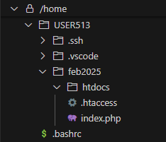
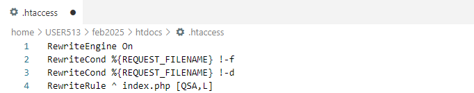
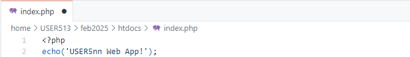
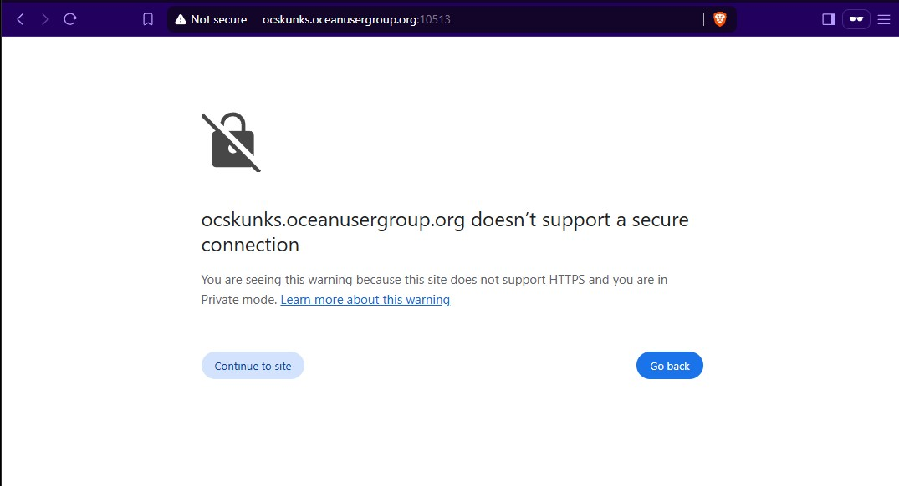

# 1. Setup (comms check)
 ➡️ In your /home/USER*nnn* directory, create a directory called `feb2025`  
 ➡️ Inside /feb2025, create a directory called `htdocs`  
 ➡️ Inside /htdocs, create a file called `.htaccess`  
(❗ there's a period at the front of the filename)  
 ➡️ Inside /htdocs, create a file called `index.php`  

Your file structure should look like this:   

 ➡️ Enter the following into `.htaccess`  
  

This Apache rewrite rule causes all incoming HTTP requests to be sent to `index.php`.  
This single point of entry into the application is often called a "front-controller".  
All requests will be handled by the front-controller first, and the front-controller can then dispatch the request to other parts of the application as needed.

 ➡️ Enter the following into `index.php` (you should use the user name you were assigned, of course)   

   

   
Line 1: All PHP files start with `&lt;?php`.      
Line 2: The `echo` function will write the text you provide to the webpage.    
> PHP doesn't actually write directly to the webpage; PHP writes to the HTTP response, which is sent back to the browser, and the browser displays the text.

 ➡️ Open your browser (use incognito or private window) and go to `http://OCSKUNKS.oceanusergroup.org:{your_port}`  
⚠️ Don't actually type "{*your_port*}", use the port number you were assigned (i.e. 10501).  
❗If you don't use the correct port number your requests either won't work, or you will be using someone else's application.  
 

You may initially get a scary looking warning about the site not being secure.  
We already know that we aren't using TLS (SSL) for the connection, so select "Continue to site" (or similar). 
  

When you press &lt;Enter&gt; in the browser, it will make a GET request to your port number (which is where *your* application lives).  
That HTTP request will be sent to `index.php`, which should output "{*your_userid*} Web App".

Your webpage should look like this:  

## 🚀 Congratulations!
If you see a webpage like that, it's success!  
You have made an HTTP request to your application, processed the request with PHP, and sent back an HTTP response!

You are ready to move on to the next section!
