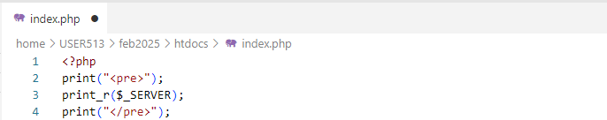
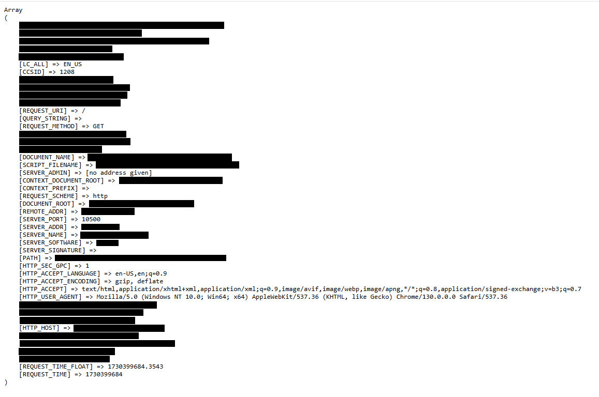
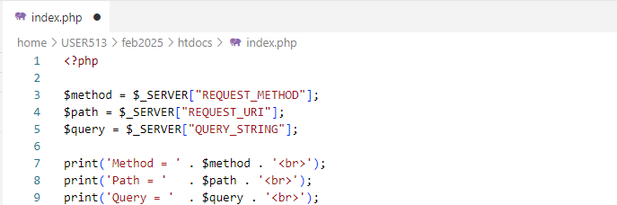
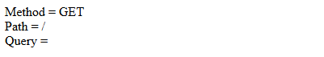
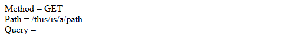
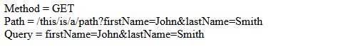

# 2. URLs

## Anatomy of a URL

The "address" you type into your browser is a URL (**U**niform **R**esource **L**ocator).  
A URL points to a unique resource on the internet.  
The URL might point to html, a CSS file, a text document, a Facebook post, a customer, bill of lading, etc.  

A URL has a few different parts:  

* SCHEME  
    A URL will begin with a "scheme", like `http`, `https`, `ftp`, etc.  
    This identifies the communication protocol being used.   
    > We will be using the `http` protocol for the workshop.  
      The concepts are the same either way, but you you should use `https` in production.    
 
    The scheme is followed by "://"  
 
* DOMAIN  
    The domain identifies the web server we want to communicate with (i.e. "amazon.com" or "www.oceanusergroup.org")  
 
* PORT  
    The port number identifies a specific application on the server.  
    The port number is separated from the domain with a colon ( : ).  
    When a web application is started on the server, it will listen for requests on a specific port number.  
    Only one application can listen on a specific port number at a time.  
    
    - There are default port numbers for well known schemes:  
    The `http` protocol defaults to port 80.  
    The `https` protocol defaults to port 443.  
    The `ftp` protocol defaults to port 21.  
     
    Example:  
    https://www.oceanusergroup.org:443 uses HTTPS protocol (scheme) to communicate with the www.oceanusergroup.org website (domain) on port 443.   
    Since port 443 is the default for https it can be omitted: https://www.oceanusergroup.org 

    **Your** web application will be on the "http://OCSKUNKS.oceanusergroup.org" server, and will be listening on a specific port number.  
 
* PATH  
    The path identifies a unique file or *resource* on the webserver that you want to work with.  
    The path begins with a forward slash ( / ).  
    Originally, the path represented the physical location of a resource on the web server.  A request to the path "/images/customers/12345.png" meant that there was a folder on the web server called "images", and inside there was a folder called "customers", and inside there was an image called "12345.png" that you wanted to work with. 

    Nowadays, however, the path is usually an abstraction and there isn't a folder structure on the server that matches the path.  For example, if we want to view the picture of employee #150, we might have a path of "/employee/150/image". There isn't an actual folder for each employee on the server; the front-controller (i.e. index.php) would know how to return the image of a specific employee reqeuested.  
      
    Example:  
    https://www.www.oceanusergroup.org:443/benefits-of-membership/ uses HTTPS protocol to communicate with the www.oceanusergroup.org server on port 443 and retrieves the page that enumerates the benefits of membership.  
 
* PARAMETERS  
    A request can also contain parameters.  
    Parameters come after the path, and begin with a question mark ( ? ).  
    Each parameter is a name/value pair, separated with a equal sign (parm = value).  
    Multiple parameters are separated by ampersand (p1=v1 & p2=v2).

    Example:  
    https://www.www.oceanusergroup.org/path/to/resource?parm1=value1&parm2=value2  

## Front-Controller
Pshew...that was a lot!  
But we need to understand URLs so that our front-controller can understand what to do with the requests that it receives.  

Let's look at how we can work with URLs in PHP.   
Each time your PHP application is called, it will be sent an array that contains all sorts of information about the request.  
This information will be in a variable named "$_SERVER".  

 ➡️ Update `index.php` so that it looks like this:  

Line 1: All PHP files start with `<?php`  
Line 2: Prints the HTML code "&lt;pre&gt;" to the webpage.  This formats the output and makes it easier to read.  
Line 3:  Prints the contents of the $_SERVER array.  
Line 4:  Ends the pre-formatted content.  

 ➡️ Refresh or open your browser and go to `http://OCSKUNKS.oceanusergroup.org:{your_port}`  

You should see something like this (without the redactions, of course 😉):  
  

That's what an array in PHP looks like; it is a set of [key] => value pairs.  

The $_SERVER array contains key=>value pairs that represent the HTTP request that was received.  
There's a lot of stuff in there, and most of it won't be important for our app.  
For our REST API we will be concerned with the `REQUEST_METHOD` and `REQUEST_URI`.  
Sometimes you will also want to see the parameters so let's include the `QUERY_STRING` as well.

 ➡️ Update `index.php` so that it looks like this:  
  

Lines 3 - 5:  
We are declaring variables named `$method`, `$path`, and `$query`.  
Variables in PHP always start with `$` and you do not specify a data type.  
To access a specific element (or key) in the array, you use the name of the array followed by the name of the key inside square brackets.  
On line 3 we assign the value of the `["REQUEST_METHOD"]` element to the `$method` variable.  

Lines 7 - 9:  
We are just printing out the values of the variables.  
To concatenate strings in PHP you use a period `.` 

 ➡️ Refresh/Open your browser and go to `http://OCSKUNKS.oceanusergroup.org:{your_port}`  

You should see something like this:  
   

 ➡️ Open your browser and go to `http://OCSKUNKS.oceanusergroup.org:{your_port}/this/is/a/path`  

You should see something like this:  
   

 ➡️ Open your browser and go to `http://OCSKUNKS.oceanusergroup.org:{your_port}/this/is/a/path?firstName=John&lastName=Smith`  

You should see something like this:  
   

## 🚀 Congratulations!
If you see a webpage like that, you are ready to start building an app!  